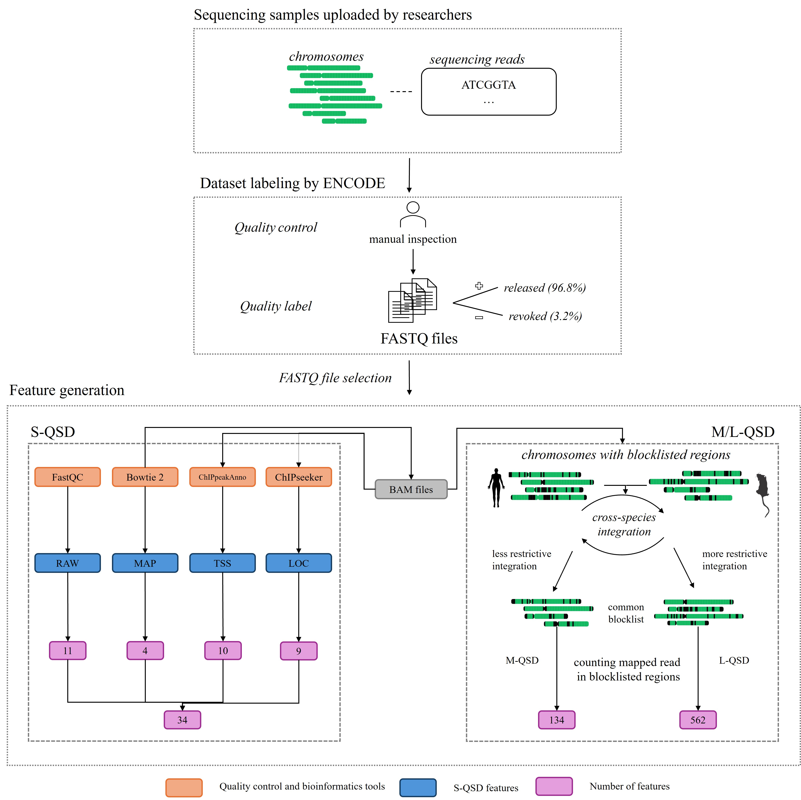

# *_S/M/L-QSD_*: Three quality-associated sequencing datasets to evaluate anomaly detection

This repository is the official implementation of [*_S/M/L-QSD_*: Three quality-associated sequencing datasets to evaluate anomaly detection](Place-holder-url). 


We generate feature sets that contain quality information to predict low-quality in fucntional genomics files, we provide a dataset of 37,491 RNA-seq, DNAse-seq, ChIP-seq and eCLIP files. 
We test Anomaliy-detection algorithms and compare them to supervised ML performance of identifying low quality features, based on ENCODE's *released* and *revoked* status. 
## Requirements

#### To install requirements for the ML Experiments:

```setup
pip install -r experiments/requirements.txt
```

#### To install requirements for the feature generation:
```setup
conda env create -f bioinf.yml
```
By using the provided yml file, it is possible to create a conda environment with all dependencies and Bioconductor packages needed. The yml file also provides an overview of all dependencies with their versions.

It can be advisable to follow the more detailed step-by-step guides provided in the [seqQscorer README](https://github.com/salbrec/seqQscorer).

The easiest and fastest way to get ready for using the feature generation pipeline is pulling the seqQscorer docker image, running it and using the feature generation script within the docker.
For more details about how to use the docker image under Linux and Windows systems, we refer to the [seqQscorer README](https://github.com/salbrec/seqQscorer).

## Experimental Results
After running the scripts "unsupervised_experiments.py" and "supervised_experiments.py", you will receive the following performance (AUC ROC mean ± standard deviation) of unsupervised anomaly detection
(top) and supervised classification (bottom) algorithms for the ChIP-Seq assay on S-QSD, M-QSD, and L-QSD.  


## Feature Generation
The script `feature_generation_pipeline_SML_QSD.py` has only one command line argument for the ENCODE accession of a raw sequencing file in FASTQ format. The pipeline autmoatically downloads this file into `./data/fastq/` and runs different tools and scripts to derive the different features. The result files from this will be saved under different directories in `./data/features/`. This is an example for creating all features for the S/M/L-QSD datasets for the sample ENCFF001NAO from ENCODE: 
```
python feature_generation_pipeline_SML_QSD.py ENCFF001NAO
```
The feature generation might be applied to multiple samples. To create the dataset containing the features for multiple NGS samples, the `gather_features_for_S_M_L_QSD_datasets.py` script can be used. It gathers all information from the different feature sets to assemble the S-QSD, M-QSD, and L-QSD datasets and create a comma-separated file for each of them.


