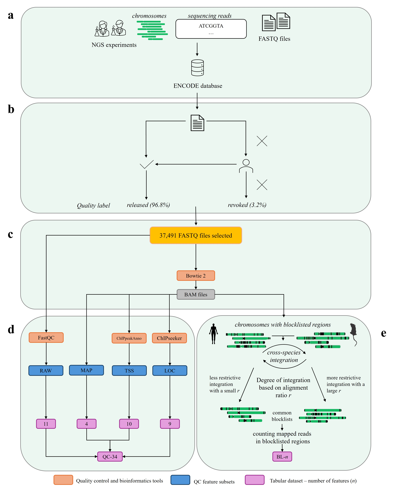

# An Imbalanced Dataset with Multiple Feature Sets for Studying Quality Control of Next-Generation Sequencing

This repository is the official implementation of [*An Imbalanced Dataset with Multiple Feature Sets for Studying Quality Control of Next-Generation Sequencing](Place-holder-url). 


We generate feature sets that contain quality information to predict low-quality in fucntional genomics files, we provide a dataset of 37,491 RNA-seq, DNAse-seq, ChIP-seq and eCLIP files. 
We test Anomaliy-detection algorithms and compare them to supervised ML performance of identifying low quality features, based on ENCODE's *released* and *revoked* status. 
## Requirements

#### To install requirements for the ML Experiments:

```setup
pip install -r experiments/requirements.txt
```

#### To install requirements for the feature generation:
```setup
conda env create -f bioinf.yml
```
By using the provided yml file, it is possible to create a conda environment with all dependencies and Bioconductor packages needed. The yml file also provides an overview of all dependencies with their versions.

It can be advisable to follow the more detailed step-by-step guides provided in the [seqQscorer README](https://github.com/salbrec/seqQscorer).

The easiest and fastest way to get ready for using the feature generation pipeline is pulling the seqQscorer docker image, running it and using the feature generation script within the docker.
For more details about how to use the docker image under Linux and Windows systems, we refer to the [seqQscorer README](https://github.com/salbrec/seqQscorer).

## Feature Validation
We validate that the proposed features are related to sequencing quality and identify *revoked* samples based on their features in unsupervised and supervised settings. We evaluated nine BL feature sets, generated using alignment ratios ranging from 0.1 to 0.9 in 0.1 increments. Each set had between eight and 1,183 features.  Echt dot shows the performance (mean AUC ROC) of the machine learning methods in an unsupervised setting (top) and a supervised setting (bottom) after 10 runs.  After running the scripts "unsupervised_feature_validation.py" and "supervised_feature_validation.py", you will receive the performance (AUC ROC mean ± standard deviation) of unsupervised anomaly detection
and supervised classification algorithms for the ChIP-Seq assay on QC-34, and BL-n.  


## Feature Generation
The script `generate_QC_and_BL_features.py` has only one command line argument for the ENCODE accession of a raw sequencing file in FASTQ format. The pipeline autmoatically downloads this file into `./data/fastq/` and runs different tools and scripts to derive the different features. The result files from this will be saved under different directories in `./data/features/`. This is an example for creating all features for the QC-34, and BL-n datasets for the sample ENCFF001NAO from ENCODE: 
```
python generate_QC_and_BL_features.py ENCFF001NAO
```
The feature generation might be applied to multiple samples. To create the dataset containing the features for multiple NGS samples, the `gather_QC_and_BL_features.py` script can be used. It gathers all information from the different feature sets to assemble the QC-34, and BL-n datasets and create a comma-separated file for each of them.

## BL-n Generation
The script `generate_QC_and_BL_features.py` creates a dataset with cross-species blocklists that come out with a minMatch ratio between 0 and 1. The ratio defines the granularity of the dataset and the number of features (n) the BL dataset will contain. This is in an example for creating BL-1183 that contains 1183 features: 
```
python generate_QC_and_BL_features.py 0.1
```


